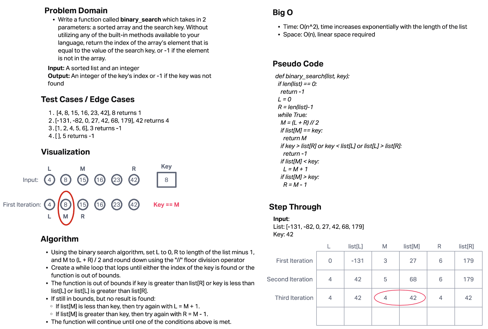

# Binary Search of Sorted Array

Write a function called BinarySearch which takes in 2 parameters: a sorted array and the search key. Without utilizing any of the built-in methods available to your language, return the index of the array’s element that is equal to the value of the search key, or -1 if the element is not in the array.

## Whiteboard Process

## Approach & Efficiency

Using the binary search algorithm, set:

* L to 0
* R to length of the list minus 1
* M to ( L + R) / 2 and round down using the "//" floor division operator

Then I used a while loop that loops until either the index of the key is found or the function is out of bounds.

The function is out of bounds if any of the following are true:

* the key is greater than list[R]
* the key is less than list[L]
* list[L] is greater than list[R]

If still in bounds , but no result is found, then:

* if list[M] is greater than key, then try again with L = M + 1
* if list[M] is less than key, then try again with R = M + 1

The function will continue until one of the conditions above is met.

Efficiency for time is O(n^2) since time increases exponentially with the length of the list. Efficiency for space is O(n) since it will increase linearly.
