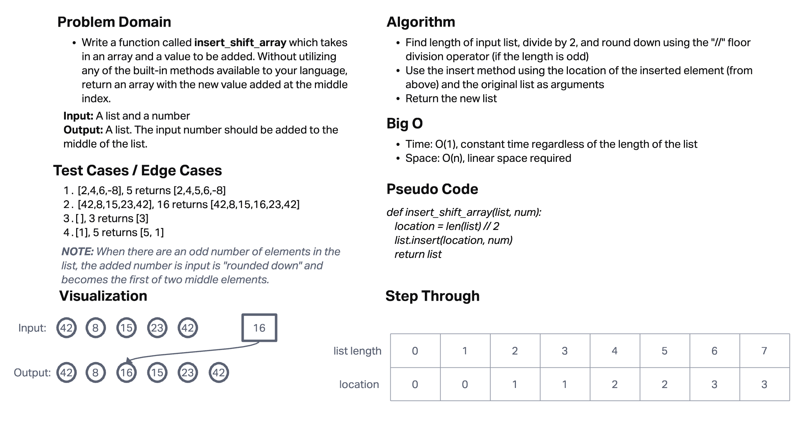

# Insert to Middle of an Array

Write a function called reverseArray which takes an array as an argument. Without utilizing any of the built-in methods available to your language, return an array with elements in reversed order.

## Whiteboard Process

## Approach & Efficiency

I found the length of the input list and divided by 2 (rounding down using the // floor division operator) and saved the number to a variable called "location". Then I used the insert method to insert the given element into the given list at the index of "location". This modified the original list, so then I returned the modified list.

Efficiency is O(1) for time since it will remain constant and O(N) for space since it will increase linearly.
