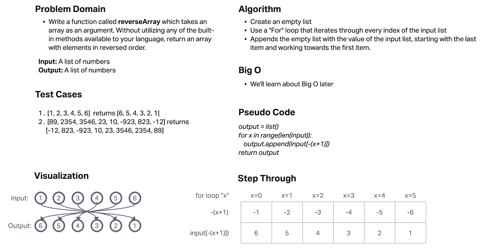

# Reverse an Array

Write a function called reverseArray which takes an array as an argument. Without utilizing any of the built-in methods available to your language, return an array with elements in reversed order.

## Whiteboard Process

## Approach & Efficiency

I created an empty list and then used a "for" loop to iterate through each index of the input list. With each iteration, I would append the value of the end of the list to the empty list and work my way towards the beginning of the input list until the list was reversed. We haven't learned about efficiency yet.

Efficiency is O(N) for time since it will increase linearly and O(N) for space since it will increase linearly as well.
