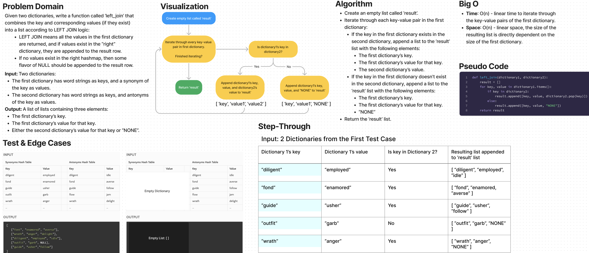

# Challenge Summary

* Given two dictionaries, write a function called `left_join` that combines the key and corresponding values (if they exist) into a list according to LEFT JOIN logic:
  * LEFT JOIN means all the values in the first dictionary are returned, and if values exist in the “right” dictionary, they are appended to the result row.
  * If no values exist in the right hashmap, then some flavor of `NULL` should be appended to the result row.
* Input: Two dictionaries:
  * The first dictionary has word strings as keys, and a synonym of the key as values.
  * The second dictionary has word strings as keys, and antonyms of the key as values.
* Output: A list of lists containing three elements:
  * The first dictionary’s key.
  * The first dictionary’s value for that key.
  * Either the second dictionary’s value for that key or “NONE”.

## Whiteboard Process

## Approach & Efficiency

Approach
* Create an empty list called ‘result’.
* Iterate through each key-value pair in the first dictionary:
  * If the key in the first dictionary exists in the second dictionary, append a list to the ‘result’ list with the following elements:
    * The first dictionary’s key.
    * The first dictionary’s value for that key.
    * The second dictionary’s value.
  * If the key in the first dictionary doesn’t exist in the second dictionary, append a list to the ‘result’ list with the following elements:
    * The first dictionary’s key.
    * The first dictionary’s value for that key.
    * “NONE”
* Return the ‘result’ list.

Efficiency
* Time: O(n) - linear time to iterate through the key-value pairs of the first dictionary.
* Space: O(n) - linear space, the size of the resulting list is directly dependent on the size of the first dictionary.

## Solution

The solution code is located in the `code_challenges/hashtable_left_join.py` file.

1. Within the virtual environment, install pytest via `pip install pytest`.
2. From the Python folder, run tests via `pytest tests/code_challenges/test_hashtable_left_join.py`.
3. All 4 tests passed.
