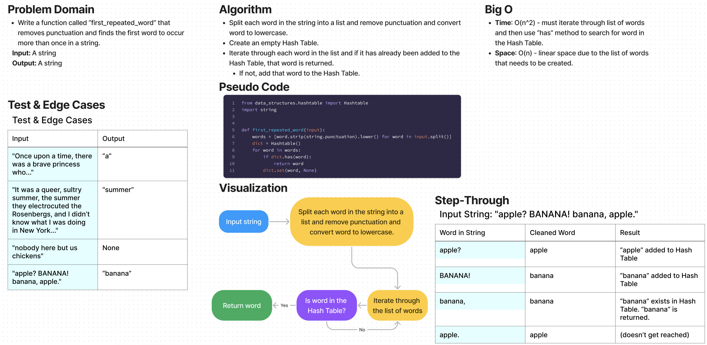

# Challenge Summary

* Write a function called “first_repeated_word” that removes punctuation and finds the first word to occur more than once in a string.

## Whiteboard Process

## Approach & Efficiency

Approach
* Split each word in the string into a list and remove punctuation and convert word to lowercase.
* Create an empty Hash Table.
* Iterate through each word in the list and if it has already been added to the Hash Table, that word is returned.
  * If not, add that word to the Hash Table.

Efficiency
* Time: O(n^2) - must iterate through list of words and then use “has” method to search for word in the Hash Table.
* Space: O(n) - linear space due to the list of words that needs to be created.

## Solution

The solution code is located in the `code_challenges/hashtable_repeated_word.py` file.

1. Within the virtual environment, install pytest via `pip install pytest`.
2. From the Python folder, run tests via `pytest tests/code_challenges/test_hashtable_repeated_word.py`.
3. All 10 tests passed.
