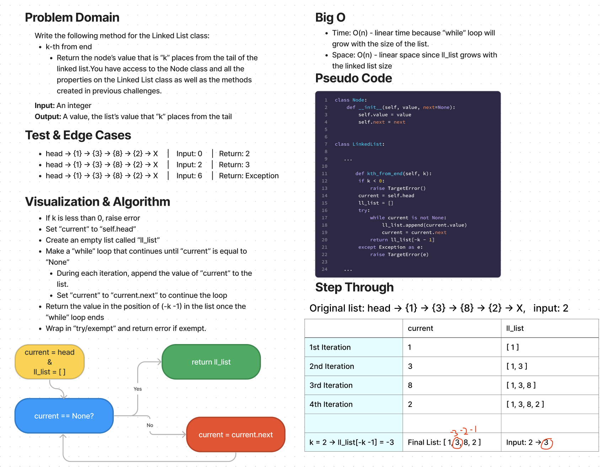

# Challenge Summary

* Write the following method for the Linked List class:
  * kth from end
    * argument: a number, k, as a parameter.
    * Return the node’s value that is k places from the tail of the linked list.
    * You have access to the Node class and all the properties on the Linked List class as well as the methods created in previous challenges.

## Whiteboard Process

## Approach & Efficiency

Given an integer `k`, find the value of `k` positions from the end of the linked list by:
* If `k` is less than 0, raise an error.
* Set `current` to `self.head`.
* Create an empty list called `ll_list`.
* Make a “while” loop that continues until `current` is equal to `None`.
  * During each iteration, append the value of `current` to the list.
  * Set `current` to `current.next` to continue the loop.
* Return the value in the position of `(-k -1)` in the list once the `while` loop ends.
* Wrap in `try/exempt` and return error if exempt.

Efficiency:
* Time: O(n) - linear time because “while” loop will grow with the size of the list.
* Space: O(n) - linear space since ll_list grows with the linked list size

## Solution

The solution code is located in the `data_structures/linked_list.py` file.

1. Within the virtual environment, install pytest via `pip install pytest`.
2. From the Python folder, run tests via `pytest tests/code_challenges/test_linked_list_insertions.py`.
3. All 6 tests passed.

Example 1:
* Linked List: head -> {1} -> {3} -> {8} -> {2} -> X
* Input: 0
* Output: 2

Example 2:
* Linked List: head -> {1} -> {3} -> {8} -> {2} -> X
* Input: 2
* Output: 3

Example 3:
* Linked List: head -> {1} -> {3} -> {8} -> {2} -> X
* Input: 6
* Output: Exception

## API

* `insert` takes in a `value` sets `self.head` equal to `Node(value, self.head)`. So the head becomes a new `Node` which has a `value` of the input and `next` being the current value of the head.
* `includes` tries to find a input value in the linked list. It takes in a `value` and sets `current` equal to `self.head` and runs a `while` loop until `current` is equal to `None`. If the `current.value` equals the input `value`, then the method returns `True`. If not, the loop sets `current` equal to `current.next` and continues the loop. If the `current` value becomes `None`, then the linked list does not contain the input value and the method returns `False`.
* `__str__` returns the linked list as a string. It sets `current` equal to `self.head`, creates an emtpy `string` variable, and runs a `while` loop until `current` is equal to `None`. While `current` does not equal `None`, then the string is appended with `{ } ->` that contains the `current.value` inside the curly brackets. Once `current` equals `None`, `string` is appended with `NULL`. The `string` variable now contains all values of the linked list and ends with "NULL".
* `append` adds the input value to the end of the list before the `NULL` value.
* `insert_before` adds an inout value before another a specified input.
* `insert_after`adds an inout value before another a specified input.
* `kth_from_end` given an integer `k`, find the value of `k` positions from the end of the linked list.
