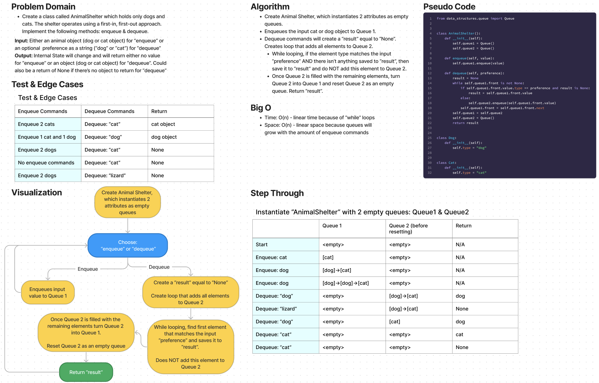

# Challenge Summary

* Create a class called AnimalShelter which holds only dogs and cats.
* The shelter operates using a first-in, first-out approach.
* Implement the following methods:
  * enqueue
    * Arguments: animal (animal can be either a dog or a cat object)
  * dequeue
    * Arguments: pref (pref can be either "dog" or "cat")
    * Return: either a dog or a cat, based on preference.
    * If pref is not "dog" or "cat" then return null.

## Whiteboard Process

## Approach & Efficiency

Approach
* Instantiate an Animal Shelter object, which instantiates 2 attributes as empty queues.
* Enqueues the input cat or dog object to Queue 1.
* Dequeue commands will create a “result” equal to “None”. Creates loop that adds all elements to Queue 2.
  * While looping, if the element type matches the input “preference” AND there isn’t anything saved to “result”, then save it to “result” and do NOT add this element to Queue 2.
  * Once Queue 2 is filled with the remaining elements, turn Queue 2 into Queue 1 and reset Queue 2 as an empty queue. Return “result”.

Efficiency
* Time: O(n) - linear time because of “while” loops
* Space: O(n) - linear space because queues will grow with the amount of enqueue commands

## Solution

The solution code is located in the `code_challenges/stack_queue_animal_shelter.py` file.

1. Within the virtual environment, install pytest via `pip install pytest`.
2. From the Python folder, run tests via `pytest tests/code_challenges/test_stack_queue_animal_shelter.py`.
3. All 5 tests passed.
