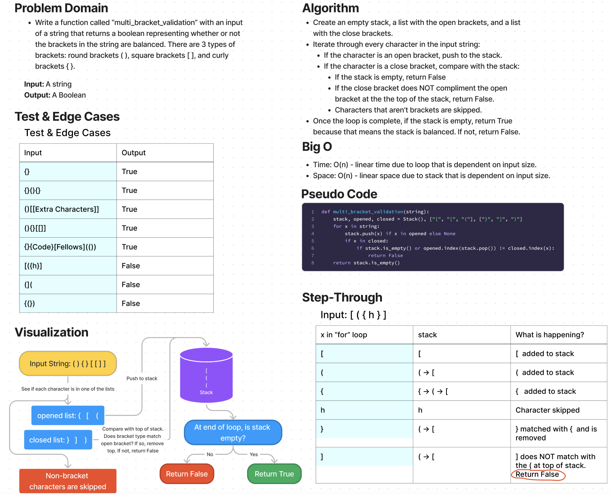

# Challenge Summary

* Write a function called `multi_bracket_validation`
  * Arguments: string
  * Return: boolean representing whether or not the brackets in the string are balanced
  * There are 3 types of brackets:
    * Round Brackets : ()
    * Square Brackets : []
    * Curly Brackets : {}

## Whiteboard Process

## Approach & Efficiency

Approach
* Create an empty stack, a list with the open brackets, and a list with the close brackets.
* Iterate through every character in the input string:
  * If the character is an open bracket, push to the stack.
  * If the character is a close bracket, compare with the stack:
    * If the stack is empty, return False
    * If the close bracket does NOT compliment the open bracket at the the top of the stack, return False.
    * Characters that aren’t brackets are skipped.
* Once the loop is complete, if the stack is empty, return True because that means the stack is balanced. If not, return False.

Efficiency
* Time: O(n) - linear time due to loop that is dependent on input size.
* Space: O(n) - linear space due to stack that is dependent on input size.

## Solution

The solution code is located in the `code_challenges/stack_queue_brackets.py` file.

1. Within the virtual environment, install pytest via `pip install pytest`.
2. From the Python folder, run tests via `pytest tests/code_challenges/test_stack_queue_brackets.py`.
3. All 9 tests passed.
