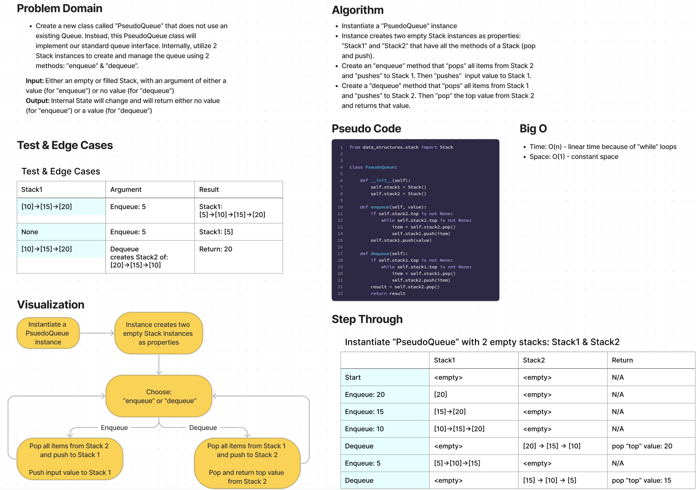

# Challenge Summary

* Create a new class called PseudoQueue.
* Do not use an existing Queue.
* Instead, this PseudoQueue class will implement our standard queue interface (the two methods listed below).
* Internally, utilize 2 Stack instances to create and manage the queue
  * Methods:
    * enqueue
      * Arguments: value
      * Inserts a value into the PseudoQueue, using a first-in, first-out approach.
    * dequeue
      * Arguments: none
      * Extracts a value from the PseudoQueue, using a first-in, first-out approach.

## Whiteboard Process

## Approach & Efficiency

Approach
* Instantiate a “PsuedoQueue” instance.
* Instance creates two empty Stack instances as properties: “Stack1” and “Stack2” that have all the methods of a Stack (pop and push).
* Create an “enqueue” method that “pops” all items from Stack 2 and “pushes” to Stack 1. Then “pushes”  input value to Stack 1.
* Create a “dequeue” method that “pops” all items from Stack 1 and “pushes” to Stack 2. Then “pop” the top value from Stack 2 and returns that value.

Efficiency
* Time: O(n) - linear time because of “while” loops
* Space: O(1) - constant space

## Solution

The solution code is located in the `code_challenges/stack_queue_pseudo.py` file.

1. Within the virtual environment, install pytest via `pip install pytest`.
2. From the Python folder, run tests via `pytest tests/code_challenges/test_stack_queue_pseudo.py`.
3. All 4 tests passed.
