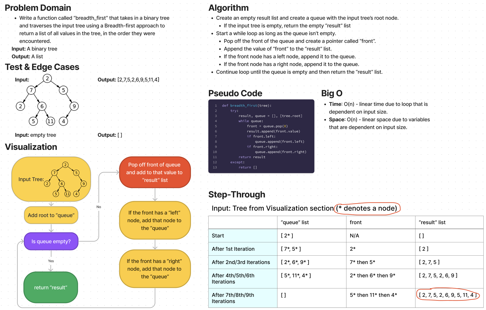

# Challenge Summary

* Write a function called “breadth_first” that takes in a binary tree and traverses the input tree using a Breadth-first approach to return a list of all values in the tree, in the order they were encountered.

## Whiteboard Process

## Approach & Efficiency

Approach
* Create an empty result list and create a queue with the input tree’s root node.
  * If the input tree is empty, return the empty “result” list
* Start a while loop as long as the queue isn’t empty.
  * Pop off the front of the queue and create a pointer called “front”.
  * Append the value of “front” to the “result” list.
  * If the front node has a left node, append it to the queue.
  * If the front node has a right node, append it to the queue.
* Continue loop until the queue is empty and then return the “result” list.

Efficiency
* Time: O(n) - linear time due to loop that is dependent on input size.
* Space: O(n) - linear space due to variables that are dependent on input size.

## Solution

The solution code is located in the `code_challenges/tree_breadth_first.py` file.

1. Within the virtual environment, install pytest via `pip install pytest`.
2. From the Python folder, run tests via `pytest tests/code_challenges/test_tree_breadth_first.py`.
3. All 6 tests passed.
