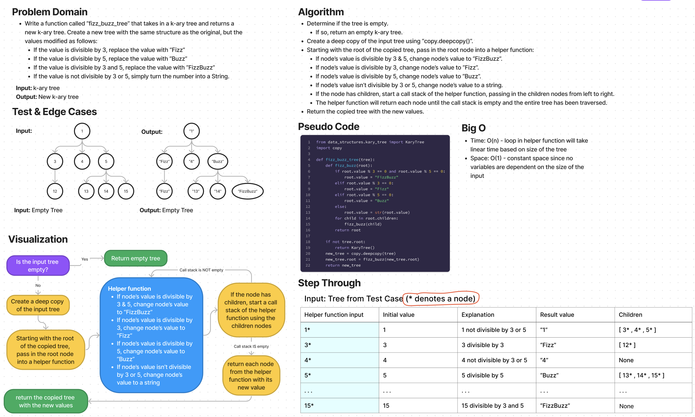

# Challenge Summary

* Write a function called “fizz_buzz_tree” that takes in a k-ary tree and returns a new k-ary tree. Create a new tree with the same structure as the original, but the values modified as follows:
  * If the value is divisible by 3, replace the value with “Fizz”
  * If the value is divisible by 5, replace the value with “Buzz”
  * If the value is divisible by 3 and 5, replace the value with “FizzBuzz”
  * If the value is not divisible by 3 or 5, simply turn the number into a String.

## Whiteboard Process

## Approach & Efficiency

Approach
* Determine if the tree is empty.
  * If so, return an empty k-ary tree.
* Create a deep copy of the input tree using “copy.deepcopy()”.
* Starting with the root of the copied tree, pass in the root node into a helper function:
  * If node’s value is divisible by 3 & 5, change node’s value to “FizzBuzz”.
  * If node’s value is divisible by 3, change node’s value to “Fizz”.
  * If node’s value is divisible by 5, change node’s value to “Buzz”.
  * If node’s value isn’t divisible by 3 or 5, change node’s value to a string.
  * If the node has children, start a call stack of the helper function, passing in the children nodes from left to right.
  * The helper function will return each node until the call stack is empty and the entire tree has been traversed.
* Return the copied tree with the new values.

Efficiency
* Time: O(n) - loop in helper function will take linear time based on size of the tree
* Space: O(1) - constant space since no variables are dependent on the size of the input

## Solution

The solution code is located in the `code_challenges/tree_fizz_buzz.py` file.

1. Within the virtual environment, install pytest via `pip install pytest`.
2. From the Python folder, run tests via `pytest tests/code_challenges/test_tree_fizz_buzz.py`.
3. All 4 tests passed.
