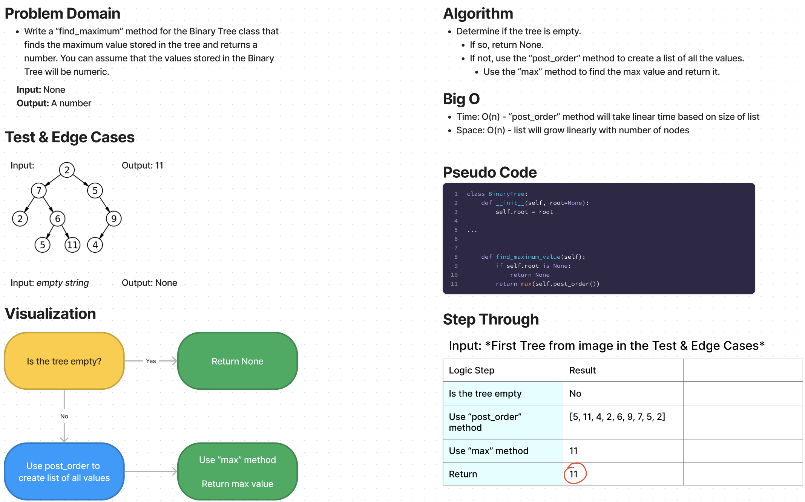

# Challenge Summary

* Write a “find_maximum_value” method for the Binary Tree class that finds the maximum value stored in the tree and returns a number. You can assume that the values stored in the Binary Tree will be numeric.

## Whiteboard Process

## Approach & Efficiency

Approach
* Determine if the tree is empty.
  * If so, return None.
  * If not, use the “post_order” method to create a list of all the values.
    * Use the “max” method to find the max value and return it.

Efficiency
* Time: O(n) - “post_order” method will take linear time based on size of list
* Space: O(n) - list will grow linearly with number of nodes

## Solution

The solution code is located in the `data_structures/binary_tree.py` file.

1. Within the virtual environment, install pytest via `pip install pytest`.
2. From the Python folder, run tests via `pytest tests/code_challenges/test_tree_max.py`.
3. All 3 tests passed.
