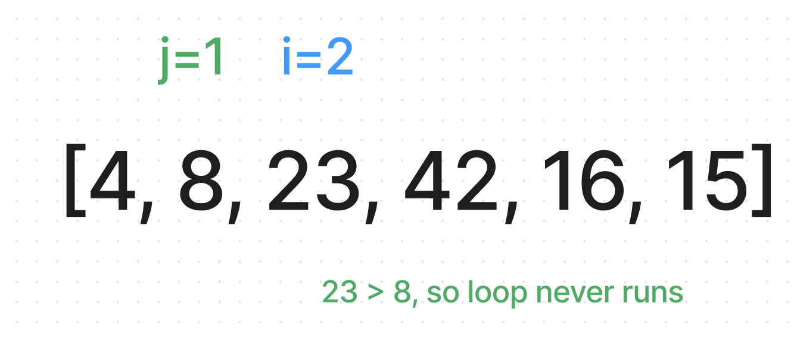

# Insertion Sort

Insertion sort is a simple sorting algorithm that builds the final sorted list one item at a time. It iterates through the list and for each element, it compares it to the elements before it and inserts it into the correct position.

## Solution Code

```
def insertion_sort(list):
    for i in range(1, len(list)):
        j = i - 1
        temp = list[i]
        while j >= 0 and temp < list[j]:
            list[j + 1] = list[j]
            j = j - 1
        list[j + 1] = temp
    return list
```

## Code Breakdown


## Trace

The outer `for` loop starts at index 1 (the second element) and iterates through the entire list. Here's a step-by-step explanation of how the algorithm works using the sample array `[8, 4, 23, 42, 16, 15]`:

#### Pass 1:

1. On the first iteration, the variable `i` is equal to `1` and the variable `j` is equal to `0`. The algorithm compares the element at index 1 (`4`) to the element at index 0 (`8`) and finds that `4` is less than `8`.
2. The inner `while` loop starts and the algorithm swaps the positions of the elements at index 0 and 1, resulting in the array `[4, 8, 23, 42, 16, 15]`.
3. The variable `j` is decremented by 1, now its `-1`, so the `while` loop exits.


#### Pass 2:

1. The outer `for` loop continues to the next iteration, with `i` now equal to `2`. The variable `j` is equal to `1`.
2. The algorithm compares the element at index 2 (`23`) to the element at index 1 (`8`) and finds that `23` is greater than `8`. The `while` loop does not execute.



#### Pass 3:

1. The outer `for` loop continues to the next iteration, with `i` now equal to `3`. The variable `j` is equal to `2`.
2. The algorithm compares the element at index 3 (`42`) to the element at index 2 (`23`) and finds that `42` is greater than `23`. The `while` loop does not execute.


#### Pass 4:

1. The outer `for` loop continues to the next iteration, with `i` now equal to `4`. The variable `j` is equal to `3`.
2. The algorithm compares the element at index 4 (`16`) to the element at index 3 (`42`) and finds that `16` is less than `42`.
3. The inner `while` loop starts and the algorithm moves the position of the element at index 3 to index 4, resulting in the array `[4, 8, 23, 42, 42, 15]`.
4. The variable `j` is decremented by 1, now its `2`, and the `while` loop continues because temp (`16`) is less than index 2 (`23`).
5. The algorithm moves the position of the element at index 2 to index 3, resulting in the array `[4, 8, 23, 23, 42, 15]`.
6. The variable `j` is decremented by 1, now its `1`, and the `while` loop stops because temp (`16`) is greater than index 1 (`8`).
7. The value of temp (`16`) now becomes the value at index 2, resulting in the array `[4, 8, 16, 23, 42, 15]`.


#### Pass 5:

1. The algorithm compares the element at index 5 (`15`) to the element at index 4 (`42`) and finds that `15` is less than `42`.
2. The inner `while` loop starts and the algorithm moves the position of the element at index 4 to index 5, resulting in the array `[4, 8, 16, 23, 42, 42]`.
3. The variable `j` is decremented by 1, now its `3`, and the `while` loop continues because temp (`15`) is less than index 3 (`23`).
4. The algorithm moves the position of the element at index 3 to index 4, resulting in the array `[4, 8, 16, 23, 23, 42]`.
5. The variable `j` is decremented by 1, now its `2`, and the `while` loop continues because temp (`15`) is less than index 2 (`16`).
6. The algorithm moves the position of the element at index 2 to index 3, resulting in the array `[4, 8, 16, 16, 23, 42]`.
7. The variable `j` is decremented by 1, now its `1`, and the `while` loop stops because temp (`15`) is greater than index 1 (`8`).
8. The value of temp (`15`) now becomes the value at index 2, resulting in the array `[4, 8, 15, 16, 23, 42]`.
9. The outer `for` loop has now completed all iterations, and the final sorted array is `[4, 8, 15, 16, 23, 42]` and that list is returned by the function.


## Efficiency

* Time: O(n^2)
  * The length of time this function takes to run with depend on the length of the input due to the outer `for` loop. But since there is a `while` loop nested in that outer `for` loop, it will be quadratic time ***O(n^2)***.
* Space: O(1)
  * No additional space is being created. This array is being sorted in place and keeping the space at constant ***O(1)***.

## Solution and Tests

The solution can be found at `python/code_challenges/insertion_sort.py`.

A full set of tests can be found at `python/tests/code_challenges/test_insertion_sort.py`.

## References / Tools

* ChatGPT
* Figma
* Replit

