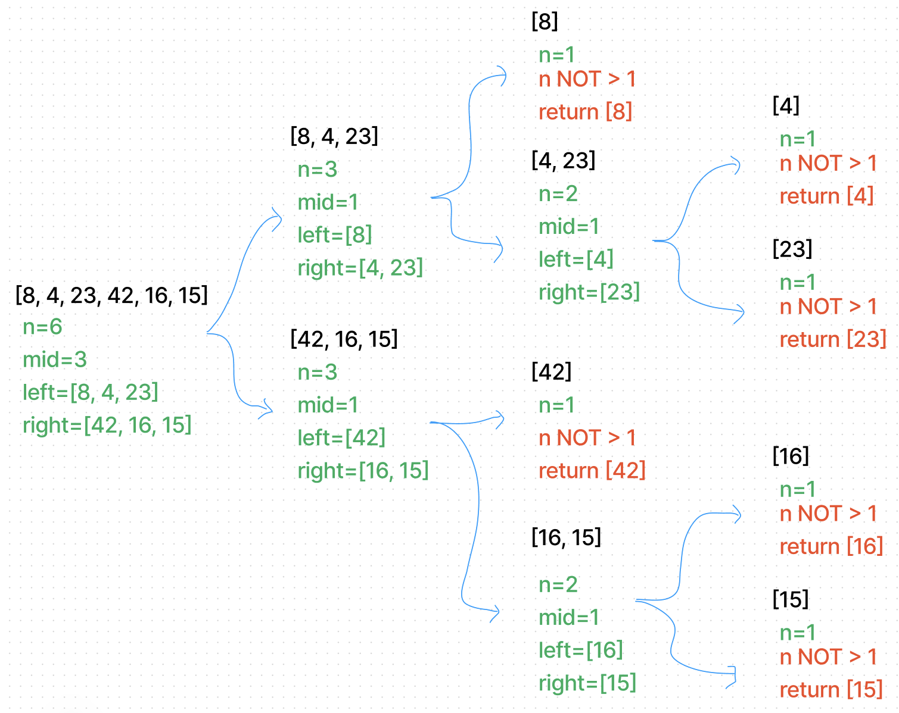

# Merge Sort

The `merge_sort` algorithm works by dividing the input list into smaller lists (`left` and `right`) and then sorting each of those smaller lists individually. Once both smaller lists are sorted, they are merged back together in a way that maintains the overall sorting of the input list.

## Solution Code

```
def merge_sort(list):
    n = len(list)
    if n > 1:
        mid = n//2
        left = list[:mid]
        right = list[mid:]
        # sort the left side
        merge_sort(left)
        # sort the right side
        merge_sort(right)
        # merge the sorted left and right sides together
        merge(left, right, list)
    return list

def merge(left, right, list):
    i = j = k = 0
    while i < len(left) and j < len(right):
        if left[i] <= right[j]:
            list[k] = left[i]
            i += 1
        else:
            list[k] = right[j]
            j = j + 1
        k += 1
    if i == len(left):
        list[k:] = right[j:]
    else:
        list[k:] = left[i:]
    return list
```

## Walk-Through

In this specific example, the input list `[8,4,23,42,16,15]` is passed into the `merge_sort` function:

#### Initial Call:

1. The length of `[8,4,23,42,16,15]` is `6`, so the `if` statement `if n > 1` is `True` and the program moves on to the next step.
2. The variable `mid` is assigned the value of `6//2`, which is `3`.
3. The variable `left` is assigned the values of the first half of the input list, which is `[8,4,23]`.
4. The variable `right` is assigned the values of the second half of the input list, which is `[42,16,15]`.

#### First Recursive Call:

1. The `merge_sort` function is called again, this time with the `left` list as the argument.
2. The length of `[8,4,23]` is `3`, so the `if` statement `if n > 1` is `True` and the program moves on to the next step.
3. The variable `mid` is assigned the value of `3//2`, which is `1`.
4. The variable `left` is assigned the values of the first half of the `left` list, which is `[8]`.
5. The variable `right` is assigned the values of the second half of the `left` list, which is `[4,23]`.

#### Second Recursive Call:

1. The `merge_sort` function is called again, this time with the `left` list as the argument.
2. The length of `[8]` is `1`, so the `if` statement `if n > 1` is `False` and the program does not go any further with sorting the `left` list.

#### Third Recursive Call

1. The `merge_sort` function is called again, this time with the `right` list as the argument.
2. The length of `[4,23]` is `2`, so the `if` statement `if n > 1` is `True` and the program moves on to the next step.
3. The variable `mid` is assigned the value of `2//2`, which is `1`.
4. The variable `left` is assigned the values of the first half of the `right` list, which is `[4]`.
5. The variable `right` is assigned the values of the second half of the `right` list, which is `[23]`.

#### Fourth Recursive Call:

1. The `merge_sort` function is called again, this time with the `left` list as the argument.
2. The length of `[4]` is `1`, so the `if` statement `if n > 1` is `False` and the program does not go any further with sorting the `left` list.

#### Fifth Recursive Call:

1. The `merge_sort` function is called again, this time with the `right` list as the argument.
2. The length of `[23]` is `1`, so the `if` statement `if n > 1` is `False` and the program does not go any further with sorting the `right` list.

#### Sixth Recursive Call

1. The `merge_sort` function is called again, this time with the `right` list as the argument.
2. The length of `[42,16,15]` is `3`, so the `if` statement `if n > 1` is `True` and the program moves on to the next step.
3. The variable `mid` is assigned the value of `3//2`, which is `1`.
4. The variable `left` is assigned the values of the first half of the `right` list, which is `[42]`.
5. The variable `right` is assigned the values of the second half of the `right` list, which is `[16,15]`.

#### Seventh Recursive Call

1. The `merge_sort` function is called again, this time with the `left` list as the argument.
2. The length of `[42]` is `1`, so the `if` statement `if n > 1` is `False` and the program does not go any further with sorting the `left` list.

#### Eighth Recursive Call

1. The `merge_sort` function is called again, this time with the `right` list as the argument.
2. The length of `[16,15]` is `2`, so the `if` statement `if n > 1` is `True` and the program moves on to the next step.
3. The variable `mid` is assigned the value of `2//2`, which is `1`.
4. The variable `left` is assigned the values of the first half of the `right` list, which is `[16]`.
5. The variable `right` is assigned the values of the second half of the `right` list, which is `[15]`.

#### Ninth Recursive Call

1. The `merge_sort` function is called again, this time with the `left` list as the argument.
2. The length of `[16]` is `1`, so the `if` statement `if n > 1` is `False` and the program does not go any further with sorting the `left` list.

#### Tenth Recursive Call

1. The `merge_sort` function is called again, this time with the `right` list as the argument.
2. The length of `[15]` is `1`, so the `if` statement `if n > 1` is `False` and the program does not go any further with sorting the `right` list.



#### Merge Back Together

1. The `merge` is used to merge two sorted lists (the `left` and `right` lists) into a single sorted list (the `list` parameter). The function uses three pointers (`i`, `j`, and `k`) to keep track of the current position in each of the three lists.
2. The function starts by initializing all three pointers to `0`. It then enters a `while` loop that continues until either the `left` or `right` list is fully processed. Within this loop, the function compares the current element of the `left` list (`left[i]`) to the current element of the `right` list (`right[j]`). If the element from the `left` list is smaller or equal to the element from the `right` list, it is added to the `list` parameter at the current position (`list[k]`). If the element from the `right` list is smaller, it is added to the `list` parameter instead.
3. After the `while` loop, the function checks whether all elements from the `left` list have been processed. If so, it appends the remaining elements from the `right` list to the `list` parameter. If not, it appends the remaining elements from the `left` list to the `list` parameter. Finally, the function returns the sorted `list` parameter.

## Efficiency

* Time: O(n*log(n))
  * The function uses a divide-and-conquer approach, where it repeatedly splits the input list in half until it reaches sublists of size 1, then merges them back together in a sorted order.
* Space: O(n)
  * The function creates new sublists at each iteration, which requires linear space.

## Solution and Tests

The solution can be found at `python/code_challenges/merge_sort.py`.

Tests can be found at `python/tests/code_challenges/test_merge_sort.py`.

## References / Tools

* ChatGPT
* Figma
