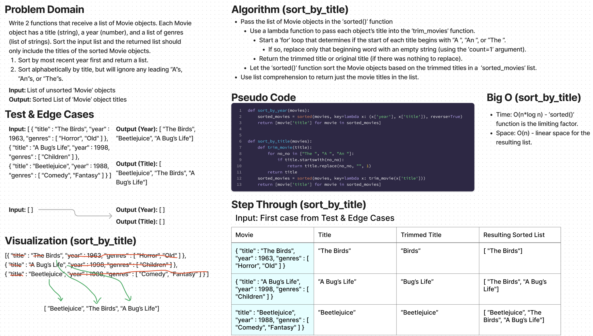

# Challenge Summary

* Write 2 functions that receive a list of Movie objects. Each Movie object has a title (string), a year (number), and a list of genres (list of strings). Sort the input list and the returned list should only include the titles of the sorted Movie objects.
  1. Sort by most recent year first and return a list.
  2. Sort alphabetically by title, but will ignore any leading “A”s, “An”s, or “The”s.

## Whiteboard Process

## Approach & Efficiency

Approach
* Pass the list of Movie objects in the ‘sorted()’ function
  * Use a lambda function to pass each object’s title into the ‘trim_movies’ function.
    * Start a ‘for’ loop that determines if the start of each title begins with “A ”, “An ”, or “The ”.
      * If so, replace only that beginning word with an empty string (using the ‘count=1’ argument).
    * Return the trimmed title or original title (if there was nothing to replace).
  * Let the ‘sorted()’ function sort the Movie objects based on the trimmed titles in a  ‘sorted_movies’ list.
* Use list comprehension to return just the movie titles in the list.

Efficiency
* Time: O(n*log n) - ‘sorted()’ function is the limiting factor.
* Space: O(n) - linear space for the resulting list.

## Solution

The solution code is located in the `python/code_challenges/sort_comparison.py` file.

1. Within the virtual environment, install pytest via `pip install pytest`.
2. From the Python folder, run tests via `pytest tests/code_challenges/test_sort_comparison.py`.
3. All 6 tests passed.
